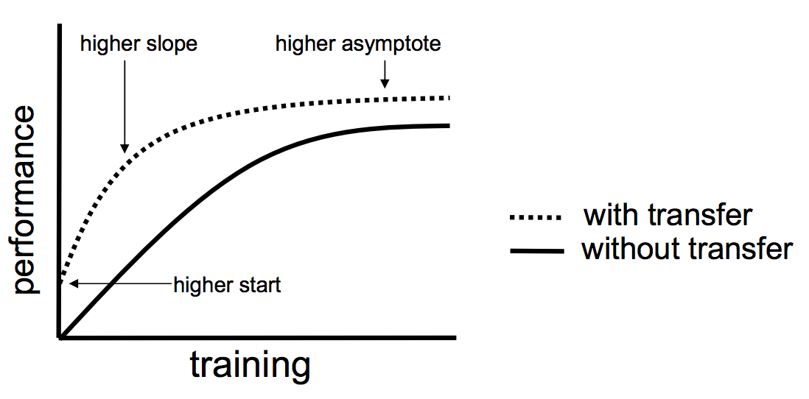

# Transfer-Learning
Transfer learning is a machine learning method where a model developed for a task is reused as the starting point for a model on a second task.

It is a popular approach in deep learning where pre-trained models are used as the starting point on computer vision and natural language processing tasks given the vast compute and time resources required to develop neural network models on these problems and from the huge jumps in skill that they provide on related problems.

In this project  , I have created a model which can detect two people in an image .

I have used the resnet-50 , inception-v3 , mobilenet , vgg16 model as the starting point of the model as it saves vast time and resources.
```
Three possible benefits to look for transfer learning - 

> Higher start. The initial skill (before refining the model) on the source model is higher than it otherwise would be.
> Higher slope. The rate of improvement of skill during training of the source model is steeper than it otherwise would be.
> Higher asymptote. The converged skill of the trained model is better than it otherwise would be.
```


